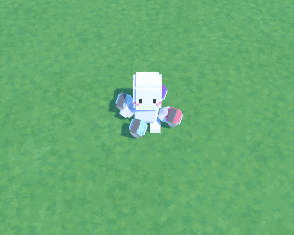
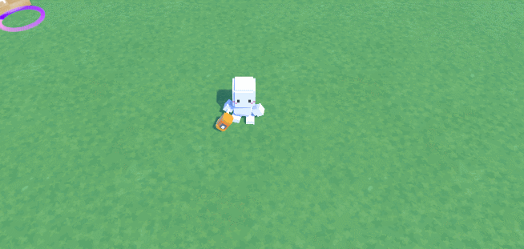
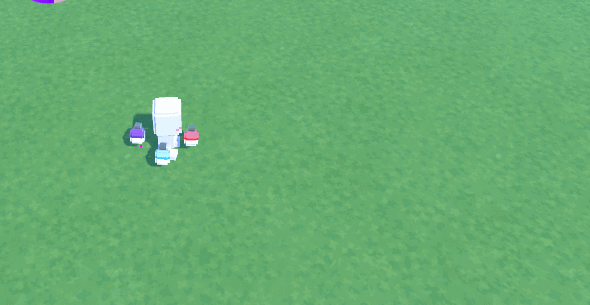
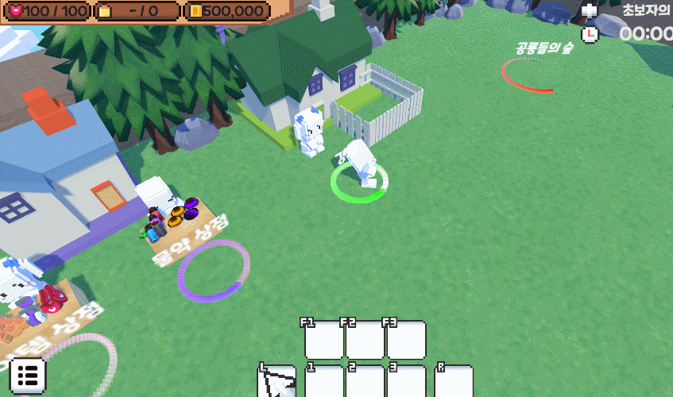
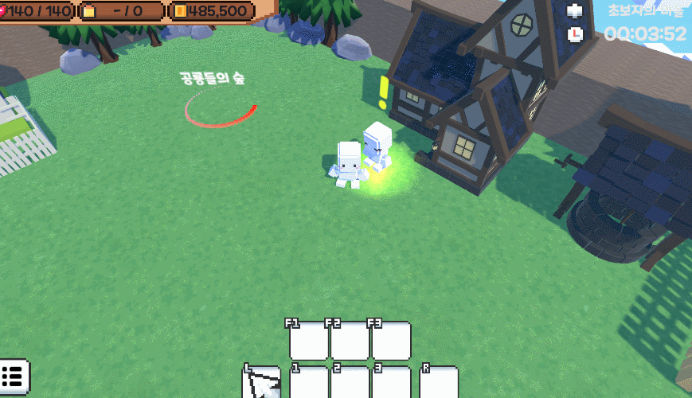
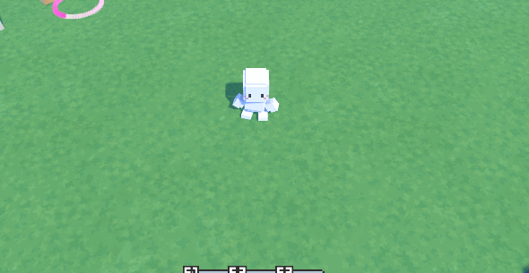

# 쿼드액션
## 게임 장르 : 3D 슈팅 액션 RPG
## 게임 소개 : 캐릭터 강화와 아이템을 사용하여 필드별 보스를 격파하는 챕터형식의 RPG
## 개발 목적 : RPG를 좋아하여 3D RPG 제작 기획
## 사용 엔진 : UNITY 2022.3.15f1
## 개발 기간 : 2023.10.31 ~ 2024.03.10
## 포트폴리오 빌드 파일 
-
## 유튜브 영상 링크
-
## 주요 활용 기술
- #01)(스크립트) Json 직렬화 사용한 데이터 관리 코드
<details>
<summary>적용 코드</summary>
  
```
      public void SaveData()
    {
        string data = JsonUtility.ToJson(nowPlayer); // JsonUtility.ToJson 메서드를 사용하여 JSON 포맷으로 직렬화(전환)
        File.WriteAllText(path + nowSlot.ToString(), data);
    }

    public void LoadData()
    {
        string data = File.ReadAllText(path + nowSlot.ToString());
        nowPlayer = JsonUtility.FromJson<PlayerData>(data); // JSON을 다시 오브젝트로 전환하려면 JsonUtility.FromJson을 사용
    }
```

</details>

***

- #02)(스크립트) 싱글톤 패턴 활용
<details>
<summary>적용 코드</summary>
  
```
    public static DataManager instance; // 싱글톤패턴

    private void Awake()
    {
        if (instance == null)
        {
            instance = this;
        }
        else if (instance != this)
        {
            Destroy(instance.gameObject);
        }
        DontDestroyOnLoad(this.gameObject);
    }
```

</details>

***

- #02)(스크립트) NavMeshAgent 활용한 자동 추적 및 복귀
<details>
<summary>적용 코드</summary>
  
```
        if (nav.enabled) // 자동으로 플레이어 추적하기
        {   
            if(Vector3.Distance(transform.position, Spawnposition.position) < 70 && !isDead) // 몬스터와 스폰장소길이가 50보다 작을때 까지 플레이어를 추적
            {
                nav.SetDestination(Target.position); // SetDestination : 도착할 목표 위치 정할 함수
                nav.isStopped = !isChase;
            }
        }

        // 몬스터와 플레이어 길이가 50보다 길거나 플레이어가 몬스터스폰장소의 길이차이가 70일때
        if (Vector3.Distance(transform.position, Target.position) > 50 && !isDead || Vector3.Distance(Target.position, Spawnposition.position) > 70)
        {
            nav.enabled = false;
            if (Vector3.Distance(transform.position, Spawnposition.position) > 5f)
            {
                // 목표 방향을 바라보는 함수 호출
                LookAtSmooth(Spawnposition.position, 0.1f);
            }
        }
        else
        {
            nav.enabled = true;
        }
```

</details>

***

- #03)(스크립트) Enemy스크립트를 이용한 상속
<details>
<summary>적용 코드</summary>
  
```
    public class Boss : Enemy
{
    public GameObject missile; // 보스 미사일
    public Transform missilePortA; // 보스 미사일 위치A
    public Transform missilePortB; // 보스 미사일 위치B

    Vector3 lookVec; // 방향 벡터
    Vector3 tauntVec; // 플레이어 위치 - 방향 벡터

    public bool isLook;

    public bool notspawn;
```

</details>

***

- #04)(스크립트) SmoothDamp를 활용한 부드러운 움직임 구현
<details>
<summary>적용 코드</summary>
  
```
    private void LookAtSmooth(Vector3 targetPosition, float smoothTime)
    {
        Vector3 direction = targetPosition - transform.position;
        Quaternion toRotation = Quaternion.LookRotation(direction.normalized);

        transform.rotation = Quaternion.Slerp(transform.rotation, toRotation, smoothTime);

        // 이동을 부드럽게 하기 위해 SmoothDamp 함수 사용
        Vector3 velocity = Vector3.zero;
        transform.position = Vector3.SmoothDamp(transform.position, targetPosition, ref velocity, smoothTime);
    }
```

</details>

***

- #05)(스크립트) string.Format를 활용한 UI 표시
<details>
<summary>적용 코드</summary>
  
```
        //상단 UI

        int hour = (int)(playTime / 3600);
        int min = (int)((playTime - hour * 3600) / 60);
        int sec = (int)(playTime % 60);
        playTimeText.text = string.Format("{0:00}", hour) + ":" + string.Format("{0:00}", min) + ":" + string.Format("{0:00}", sec);

        //플레이어 UI
        playerHealthText.text = player.health + " / " + player.maxhealth;
        playerCoinText.text = string.Format("{0:n0}", player.coin);
        if (player.equipWeapon == null)
            playerAmmoText.text = "- / " + player.ammo;
        else if (player.equipWeapon.type == Weapon.Type.Melee)
            playerAmmoText.text = "- / " + player.ammo;
        else
            playerAmmoText.text = player.equipWeapon.curammo + " / " + player.ammo;
```

</details>

***

- #06)(스크립트) 텍스트 깜빡임 효과
<details>
<summary>적용 코드 및 이미지</summary>
  
```
    public IEnumerator BossCreateText() // UI 보스 출현 깜빡임효과
    {
        while (bosscomingText.color.a > 0) // 알파 값 감소
        {
            bosscomingText.color = new Color(bosscomingText.color.r, bosscomingText.color.g, bosscomingText.color.b, bosscomingText.color.a - (Time.deltaTime * 1f));
            bosscomingImage.color = new Color(bosscomingImage.color.r, bosscomingImage.color.g, bosscomingImage.color.b, bosscomingImage.color.a - (Time.deltaTime * 1f));
            yield return null;
        }

        yield return new WaitForSeconds(0.1f);

        // 텍스트가 서서히 나타나도록 함
        while (bosscomingText.color.a < 1) // 알파 값 다시 증가
        {
            bosscomingText.color = new Color(bosscomingText.color.r, bosscomingText.color.g, bosscomingText.color.b, bosscomingText.color.a + (Time.deltaTime * 1f));
            bosscomingImage.color = new Color(bosscomingImage.color.r, bosscomingImage.color.g, bosscomingImage.color.b, bosscomingImage.color.a + (Time.deltaTime * 1f));
            yield return null;
        }

        // 대기
        yield return new WaitForSeconds(0.1f);
        StartCoroutine(BossCreateText());
    }
```


</details>

***

- #07)(스크립트) string.IsNullOrWhiteSpace 문자열 판별
<details>
<summary>적용 코드</summary>
  
```
    public void NextBtnClick()
    {
        if (string.IsNullOrWhiteSpace(text[Count + 1]) == false)
        {
            Count++;
            LudoText.text = text[Count];
        }
        else if(string.IsNullOrWhiteSpace(text[Count + 1]) == true)
        {
            NextBtn.SetActive(false);
            YesBtn.SetActive(true);
            NoBtn.SetActive(true);
        }

        SoundManager.instance.Effect_Sound.clip = SoundManager.instance.EffectGroup[12];
        SoundManager.instance.Effect_Sound.Play();
    }
```

</details>

***

- #08)(스크립트) RotateAround을 통한 회전구현
<details>
<summary>적용 코드 및 이미지</summary>
  
```
    public Transform target; // 타겟 설정
    public float orbitspeed; // 회전 속도
    Vector3 offset;
    // Start is called before the first frame update
    void Start()
    {
        offset = transform.position - target.position;
    }

    void Update()
    {
        transform.position = target.position + offset;
        transform.RotateAround(target.position, Vector3.up, orbitspeed * Time.deltaTime); // RotateAround 회전시켜주는함수
        offset = transform.position - target.position;
    }
```

</details>

***

- #09)(스크립트) List를 활용한 랜덤퀘스트 구현
<details>
<summary>적용 코드 및 이미지</summary>
  
```
public class QuestData
{
    public int QuestID;
    public string QuestTitle;
    public string ContentText;
    public bool Clear;
    public int Giftitem;
    public int Giftvalue;
}

public QuestDataList questDataList = new QuestDataList(); // 퀘스트 목록을 저장할 객체

    void QuestList()
    {
        QuestData newQuest1 = new QuestData();
        newQuest1.QuestID = 1;
        newQuest1.QuestTitle = "마을의 일거리를 도와주세요!";
        newQuest1.ContentText = "일이 너무 많아서 쉴 수가 없어요.\n일 좀 정리해주세요!";
        newQuest1.Clear = false;
        newQuest1.Giftitem = 0;
        newQuest1.Giftvalue = 1000;
        questDataList.questDataList.Add(newQuest1);
     ......
    }
```

</details>

***

- #10)(스크립트) Physics Cast함수 이용한 물리충돌 감지
<details>
<summary>적용 코드</summary>
  
```
        RaycastHit[] rayHits = Physics.SphereCastAll(transform.position, 3, Vector3.up, 0f, LayerMask.GetMask("Player")); // 플레이어 감지
        foreach (RaycastHit hit in rayHits) // 플레이어가 감지됐다면
        {
            enterPlayer = hit.transform.gameObject.GetComponent<Player>();
            enterPlayer.nearObject = this.gameObject;
            FindPlayer = true;
            Debug.Log("플레이어가 왔습니다");
        }

        if(FindPlayer == true && rayHits.Length == 0) // 감지된 플레이어 배열이 0개라면,
        {
            FindPlayer = false;
            enterPlayer.nearObject = null;
            Exit();
            Debug.Log("플레이어가 떠낫습니다");
        }
```

</details>

***

- #11)(이미지) Enum을 통해 분류하여 구현한 싸움 방식 ( 헤머 & 총 )
<details>
<summary>적용 이미지</summary>
  


</details>

***

- #12)(이미지) 파티클 시스템을 이용한 수류탄 효과
<details>
<summary>적용 코드 및 이미지</summary>

```
    IEnumerator Explosion() // 코루틴
    {
        yield return new WaitForSeconds(3f); // 3초뒤 발동
        SoundManager.instance.Effect_Sound.clip = SoundManager.instance.EffectGroup[7];
        SoundManager.instance.Effect_Sound.Play();
        rigid.velocity = Vector3.zero;
        rigid.angularVelocity = Vector3.zero;
        meshObj.SetActive(false);
        effectObj.SetActive(true); // 임팩트 발동

        RaycastHit[] rayHits = Physics.SphereCastAll(transform.position, 15, Vector3.up, 0f, LayerMask.GetMask("Enemy")); // SphereCastAll : 구체모양 레이캐스팅

        if(type == Type.Property) // 만약 타입이 있는 수류탄이라면
        {
            Instantiate(effect, transform.position, transform.rotation); // 저장돼있는 임펙트 활성화
        }
        else
        {
            foreach (RaycastHit hitObj in rayHits) // 레이히트에 접촉한 enemy들에게 적용
            {
                hitObj.transform.GetComponent<Enemy>().HitByGrenade(transform.position);
            }
        }
        Destroy(gameObject, 5f);
    }
```



</details>

***

- #13)(이미지) 플레이어 강화 시스템
<details>
<summary>이미지</summary>



</details>

***

- #14)(이미지) 메인퀘스트 시스템
<details>
<summary>적용 이미지</summary>
  


</details>

***

- #15)(이미지) 튜토리얼 시스템
<details>
<summary>적용 이미지</summary>
  


</details>

***

- #16)(이미지) 물약 버프 시스템
<details>
<summary>적용 코드 및 이미지</summary>

```
    void Potion(int value) // 포션별 능력치 강화
    {
        isbuff = true; // 버프 중첩 방지 bool
        buffEffect.SetActive(true); // 버프 임팩트 활성화
        GameObject hand = GameObject.Find("Weapon Point"); // 버프를 위한 무기들 호출
        Weapon Hammer = hand.transform.GetChild(0).gameObject.GetComponent<Weapon>();
        Weapon Handgun = hand.transform.GetChild(1).gameObject.GetComponent<Weapon>();
        Weapon Subgun = hand.transform.GetChild(2).gameObject.GetComponent<Weapon>();

        switch (value) // 버프 포션 value값에 따른 버프 값
        {
            case 0:
                speed += 10;
                buffcolor = Color.green;
                break;
            case 1:
                maxhealth += 50;
                buffcolor = Color.red;
                break;
            case 2:
                Hammer.damage += 10;
                Handgun.damage += 7;
                Subgun.damage += 3;
                buffcolor = new Color(1f / 255f, 235f / 255f, 255f / 255f);
                break;
            case 3:
                Hammer.rate -= 0.2f;
                Handgun.rate -= 0.1f;
                Subgun.rate -= 0.04f;
                buffcolor = Color.gray;
                break;
            case 4:
                iscbuff = true;
                buffcolor = new Color(255f / 255f, 1f / 255f, 221f / 255f);
                break;
        }
        StopCoroutine(Buffcontrol(value));
        StartCoroutine(Buffcontrol(value));
    }
```


</details>

***

- #17)(이미지) 메뉴 시스템 및 데이터 저장 버튼
<details>
<summary>적용 이미지</summary>
  


</details>

***

- #18)(스크립트) 데이터 삭제
<details>
<summary>적용 코드 및 이미지</summary>
  
```
    public void DeleteData()
    {
        File.Delete(DataManager.instance.path + BtnValue); // path경로에 있는 데이터 삭제
        slotText[BtnValue].text = "비어있음"; // 비어있음으로 다시 초기화
        savefile[BtnValue] = false;
    }
```


</details>

***
